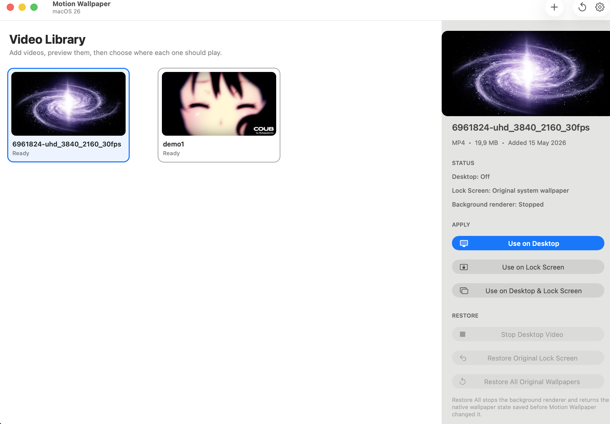

# Motion Wallpaper — macOS 26+



Motion Wallpaper is a native macOS 26 (Tahoe) and later utility for live desktop video wallpapers and video on the real macOS lock screen.

This build requires **macOS 26 or later**. The deployment target and `LSMinimumSystemVersion` are both set to `26.0`, and the app checks at runtime that it is running on macOS 26.0 or later.

## Installing an unsigned build

Motion Wallpaper is not signed with a paid Apple Developer certificate, so Gatekeeper will block it by default. Copy `MotionWallpaper.app` to your `Applications` folder, then open Terminal and run:

```bash
xattr -dr com.apple.quarantine "/Applications/MotionWallpaper.app"
codesign --force --deep --sign - "/Applications/MotionWallpaper.app"
open "/Applications/MotionWallpaper.app"
```

Alternatively, try to open Motion Wallpaper once, then go to **System Settings → Privacy & Security** and select **Open Anyway**.

## Desktop wallpaper

The desktop video is rendered by a lightweight hidden instance of the Motion Wallpaper executable launched with:

```text
--desktop-agent
```

The agent owns borderless desktop-level AppKit windows on every display. **Use on Desktop** starts this continuously looping renderer. It remains alive after the main Motion Wallpaper UI quits, so the video keeps playing until you explicitly stop it or log out.

**Use on Desktop & Lock Screen** uses the native Aerial wallpaper instead. It stops the separate desktop renderer after installation so macOS can slow the lock-screen video to a still frame on the desktop.

The desktop renderer respects these options:

- Start desktop wallpaper when the app launches
- Launch Motion Wallpaper at login
- Mute desktop video
- Fill screen while preserving aspect ratio

## Lock screen

macOS does not provide a public API for arbitrary lock-screen video. Motion Wallpaper uses the native `WallpaperAerialsExtension` pipeline on macOS 26 and 27.

Before using the lock-screen feature for the first time, open **System Settings → Wallpaper** and download at least one Apple Aerial. macOS stores downloaded Aerial movies here:

```text
~/Library/Application Support/com.apple.wallpaper/aerials/videos/
```

On macOS 27, adding a video starts a one-time conversion to an HEVC Main 10 MOV with the source video's duration and temporal layers (`tscl` and `tsas`). The original video remains in the library for previews and desktop playback. Older library videos show **Needs conversion** and a **Convert for Lock Screen** button. The lock-screen actions are available only after conversion finishes. The prepared MOV is saved under `~/Library/Application Support/MotionWallpaper/Prepared/macOS27-v1/` and reused for later installs.

The **Online Catalog** section accepts a user-provided HTTPS URL that returns a JSON array. It displays entries in the server's order and uses their `title`, `mwID`, `download_url`, `duration_seconds`, and `file_size` fields. The entered URL and catalog entries are saved locally and restored after restart. **Update Catalog** replaces the saved snapshot after a successful fetch; a failed update leaves the previous catalog intact. Catalog cards and the detail preview load a JPEG at `file/{mwID}.jpeg`. The video plays in the preview only after it has been downloaded and converted. **Download & Convert** downloads the selected MP4, converts it to the same HEVC format used for lock-screen video, deletes the temporary download, and stores only the converted MOV. Downloaded entries show a green check and can then be applied like local videos.

When you apply a prepared lock-screen video, Motion Wallpaper:

1. Saves the current native wallpaper `Index.plist` before making the first change.
2. Saves the current screen-saver module preference before switching it to the Aerial renderer.
3. Saves the original Apple Aerial movie that will be used as the system playback slot.
4. On macOS 26, converts the selected video to a video-only MOV and repeats it to roughly three minutes. On macOS 27, uses the prepared HEVC video with temporal layers required by the Aerial player during lock/unlock transitions. Preparation needs a hardware HEVC encoder and can take a while for long or 4K source clips.
5. Atomically swaps the converted video into the selected Aerial slot.
6. Selects that Aerial asset in macOS's wallpaper store.
7. Configures the screen saver to use `WallpaperAerialsExtension`.
8. Refreshes the lock-screen poster when possible.
9. Clears wallpaper caches and restarts the wallpaper renderer.
10. On macOS 26, restarts `WallpaperAerialsExtension` after unlock to keep repeated lock/unlock cycles stable. On macOS 27, leaves the extension running so it can complete the unlock transition.

After upgrading from macOS 26 to 27, convert the existing library video and install it again. An older H.264 Aerial slot does not gain the required temporal layers automatically.

The app shows encoding progress during macOS 27 conversion. **Cancel Conversion** stops the encoder and leaves the original library video available for a later attempt.

The original native wallpaper store snapshot is saved under:

```text
~/Library/Application Support/MotionWallpaper/OriginalSystemWallpaper/
```

The original Apple Aerial backup is saved under:

```text
~/Library/Application Support/MotionWallpaper/MacOS26LockScreen/Backups/
```

## Restore behavior

**Stop Desktop Video** stops the detached desktop renderer. If the lock-screen Aerial pipeline is still installed, macOS may still have that Aerial selected as the native wallpaper underneath the desktop renderer.

**Restore Original Lock Screen** restores the original Aerial, native wallpaper store, lock-screen poster (when available), and the previous screen-saver module preference captured before the first lock-screen installation.

**Restore All Original Wallpapers** stops the desktop renderer and restores every saved native wallpaper/screen-saver value that Motion Wallpaper changes.

## Build

Use Xcode with the macOS 26 or later SDK. Open:

```text
MotionWallpaper.xcodeproj
```

or run:

```bash
./INSTALL.command
```

`INSTALL.command` builds an ad-hoc signed Debug build and opens `MotionWallpaper.app`.

## Diagnostics

The most recent lock-screen installation report is written to:

```text
~/Library/Application Support/MotionWallpaper/macos26-lock-screen-install-report.json
```

## License

Motion Wallpaper is free software, licensed under the [GNU General Public License v3.0](LICENSE). You are free to use, copy, modify, and redistribute this project, provided any distributed version (modified or not) stays open source under the same license and retains attribution to the original authors.
